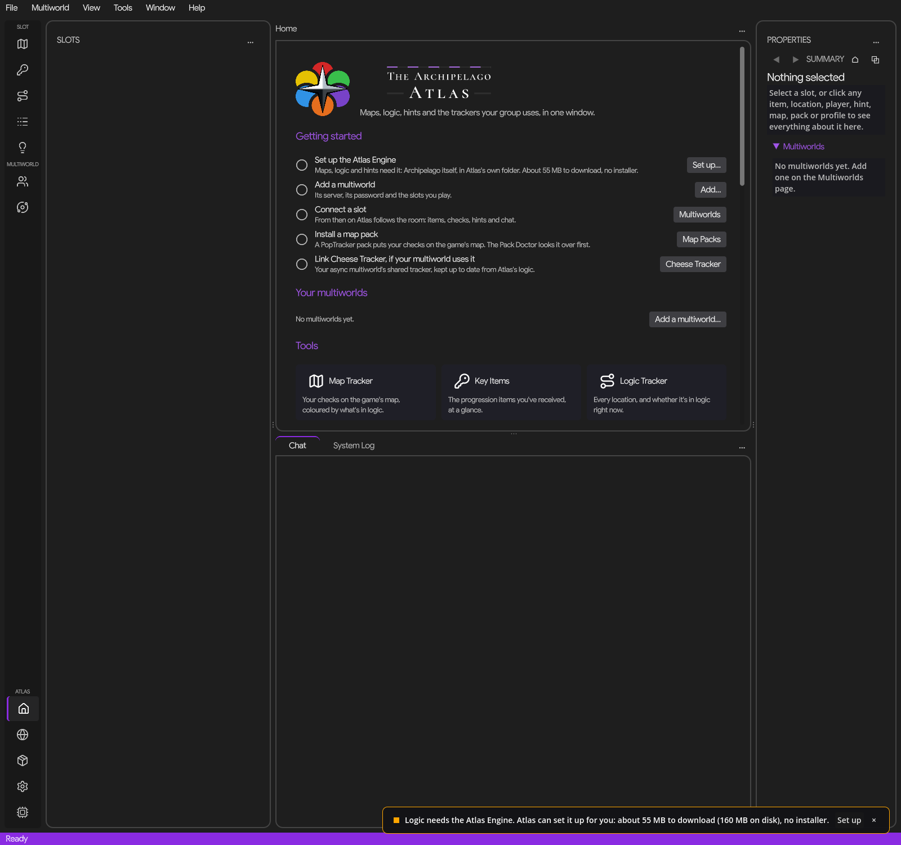

# The Archipelago Atlas

A desktop companion for [Archipelago](https://archipelago.gg) multiworld randomizers, for Windows. Maps, logic, hints, item history and the trackers your group uses, in one window, for every slot you play.

> **Status: beta.** Atlas is in a closed beta before its first public release, 0.1.0. Expect rough edges, and please [report what you find](https://github.com/Lt-Tuttle/archipelago-atlas/issues).

## What Atlas does

- **Several slots and multiworlds at once.** Each slot gets its own text client, and every tool follows the slot you pick. Reconnects are careful: capped, backed off, and they stop when the server says no.
- **Map Tracker.** Your checks on the game's map, from PopTracker packs, coloured by what's in logic right now. The Pack Doctor checks packs, fixes what it can (with undo) and writes a report for the pack's author.
- **Logic Tracker and Key Items.** Archipelago's own logic, run by the Atlas Engine: a portable copy of Archipelago and Universal Tracker that Atlas sets up in its own folder from hash-checked downloads, matching each seed's apworld version. No Python install, no PATH changes.
- **Item History and Hints.** Everything you've received and found, and every hint for you or in your world, in tables that sort, hide columns, search and export (TSV, CSV, Markdown or Discord-sized messages).
- **Properties.** Click any location, item, player, hint, map or pack to see everything about it, with history, notes and "why is this in logic".
- **Cheese Tracker.** Your async's shared tracker, read and (with your say) updated from Atlas's logic: slot statuses, hints and the room overview.
- **Sphere Tracker.** Reads the host's spheretracker.de room, read-only, and hides itself in race mode.
- **A proper desktop app.** Menu bar, command palette (Ctrl+Shift+P), rebindable shortcuts, one searchable Settings page, Dark, Light and High contrast themes (or follow Windows), colour-blind-safe palettes, zoom, and full keyboard and screen-reader support.

## Download and run

1. Download `TheArchipelagoAtlas-<version>-win-x64.zip` from the [latest release](https://github.com/Lt-Tuttle/archipelago-atlas/releases). `SHA256SUMS.txt` next to it lets you check the file.
2. Unzip it into a folder of your own with a short path, such as `C:\Games\Atlas` (Windows limits a file's path to 259 characters, and the engine Atlas sets up goes a few folders deep). Atlas is portable: it keeps everything in its own `PortableData` folder, and nothing is installed.
3. Run `The Archipelago Atlas.exe`. Home walks you through the first steps.

Atlas needs Windows 10 or 11 (64-bit). Updates are offered inside Atlas, with your permission, and never installed without a click.

**About the Windows SmartScreen warning.** Atlas's beta builds aren't code-signed yet, so the first run may show "Windows protected your PC". That warning means the publisher is unknown to Microsoft, not that anything was found. Click **More info**, then **Run anyway**. Builds are produced by [GitHub Actions](https://github.com/Lt-Tuttle/archipelago-atlas/actions/workflows/release.yml) from the tagged source, so you can check what you're running. Signing through the SignPath Foundation is planned for the first stable release.

## Privacy

Your PC is yours, and so is your data.

- **Nothing leaves your PC without your say.** Atlas asks the first time it needs to go anywhere new (an update check, a room's status page, Cheese Tracker, GitHub) and the first time it needs to look outside its own folder. Every answer is listed under **Settings → Privacy & permissions**, where you can take it back.
- **No account, no telemetry, no analytics.** Crash reports are opt-in: after a problem, Atlas shows you the whole report before anything is sent, and it never includes names, paths, servers, slots, chat or log lines.
- **Light on Archipelago's servers.** One request at a time per site, cached answers, backoff after failures, and Atlas never loads a room's page by itself (that would wake a sleeping room).
- **Secrets stay encrypted** for your Windows account: room passwords and your Cheese Tracker API key.

The full statement, with every site Atlas can talk to, is in the app under **Help → About** and in [SECURITY.md](SECURITY.md).

## Unofficial

The Archipelago Atlas is a community tool. It is not affiliated with or endorsed by the Archipelago project.

## Made with AI assistance

Atlas is designed, directed and tested by [Lt-Tuttle](https://github.com/Lt-Tuttle). Most of its code was written with an AI assistant (Anthropic's Claude), under the author's direction and review. Atlas's icon is AI-generated.

## License and credits

Atlas's own code is released under the [MIT License](LICENSE). It builds on the work of others:

- [Godot Engine](https://godotengine.org) and [.NET](https://dotnet.microsoft.com).
- [Archipelago](https://github.com/ArchipelagoMW/Archipelago) and [Archipelago.MultiClient.Net](https://github.com/ArchipelagoMW/Archipelago.MultiClient.Net).
- [Universal Tracker](https://github.com/FarisTheAncient/Archipelago).
- [PopTracker](https://github.com/black-sliver/PopTracker) and the pack authors.
- [Cheese Tracker](https://github.com/cdhowie/cheese-trackers) by Chris Howie, and [spheretracker.de](https://spheretracker.de).
- [Hydra Text Client](https://github.com/SWCreeperKing/HydraTextClient_Rewrite), which inspired Atlas's text client.
- [Lucide](https://lucide.dev) and [Feather](https://feathericons.com) icons, and the Google Sans, Google Sans Code and Cormorant fonts (SIL Open Font License).

Full credits, with every author, official link and license, are in [CREDITS.md](CREDITS.md). The license texts of everything built into Atlas are in [THIRD_PARTY_NOTICES.md](THIRD_PARTY_NOTICES.md).

## Contributing and support

- **Found a bug or want a feature?** Open an [issue](https://github.com/Lt-Tuttle/archipelago-atlas/issues/new/choose). Help → Report a Problem in Atlas writes a scrubbed zip you can attach.
- **Questions and ideas:** [Discussions](https://github.com/Lt-Tuttle/archipelago-atlas/discussions).
- **Security problems:** please report them privately, as [SECURITY.md](SECURITY.md) describes.
- **Code:** [CONTRIBUTING.md](CONTRIBUTING.md) covers building, the tests and the guard rails every change passes; [docs/ARCHITECTURE.md](docs/ARCHITECTURE.md) explains how Atlas is put together; [CODE_OF_CONDUCT.md](CODE_OF_CONDUCT.md) applies everywhere.
- **The guide** is built into Atlas (Help → Guide, F1) and lives in [docs/GUIDE.md](docs/GUIDE.md).
